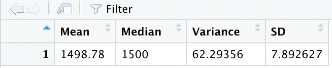

# MechaCar Statistical Analysis

## Linear Regression to Predict MPG

To predict MPG (miles per gallon) of prototype MechaCars, we performed a linear regression:
mpg = β0 + β1*vehicle_length+ β2*vehicle_weight + β3*spoiler_angle + β4*ground_clearance + β5\*AWD + ε

Our result was as follows:

- Only vehicle_length and ground_clearance had a significant and positive impact on mpg of MechaCar prototypes. They had small p-values.
- The intercept of the linear model could not be considered as zero since it had a significant and negative impact on mpg. The significance of the intercept indicated that there were other factors that contributed to predicting the MPG result that had not been included in our dataset.
- To indicate whether this linear model predicted the mpg of MechaCar prototypes, we needed to look at the value of adjusted R-squared since it was a multiple-variable linear regression. This linear model could explain the mpg of MechaCar prototypes effectively as the adjusted R-squared was equal to 0.6825. It meant that out of 100 instances, our model could approximately predict the mpg of MechaCar prototypes 68 times correctly.

## Summary Statistics on Suspension Coils

We used the suspension coil’s PSI to test if the manufacturing process was consistent across production lots. The requirement was that the variance of the suspension coils must not exceed 100 pounds per square inch.

The statistical summary for all manufacturing lots was as follows:

- The manufacturing lots in total met this specification, and its variance was 62.29.

The statistical summary for each lot individually was as follows:

- Lot1 and Lot2 had a small variance comparing with Lot3.
- Lot3 didn’t meet the requirement since its variance was 170.29, which exceeded 100. It indicated that the manufacturing process for Lot3 might experience some inconsistency.

## T-Tests on Suspension Coils

The t-test that compared the PSI across all manufacturing lots against the population mean of 1,500 was as follows:

- t = -1.8931 < t0.05/2,149, which was around 1.9, so we cannot reject the hypothesis. The PSI across all manufacturing lots was not statistically different from the population mean of 1,500.
  The t-test that compared the PSI of lot1 against the population mean of 1,500 was as follows:

- t = 0 < t0.05/2,49, which was around 2, so we cannot reject the hypothesis. The PSI of lot1 was not statistically different from the population mean of 1,500.
  The t-test that compared the PSI of lot2 against the population mean of 1,500 was as follows:

- t = 0.51745 < t0.05/2,49, which was around 2, so we cannot reject the hypothesis. The PSI of lot2 was not statistically different from the population mean of 1,500.
  The t-test that compared the PSI of lot3 against the population mean of 1,500 was as follows:

- t = -2.0916 < t0.05/2,49, which was around 2, so we cannot reject the hypothesis. The PSI of lot3 was not statistically different from the population mean of 1,500.

To sum up, all t-tests on Suspension Coils suggested that the PSI for manufacturing lots and for each lot were not statistically different from the population mean of 1,500.

## Study Design: MechaCar vs Competition

To compare the performance of MechaCar against the performance of vehicles from other manufacturers, I proposed to collect the maintenance cost information as metrics.

My null hypothesis was that there was no difference between the maintenance cost of MechaCars and the cost of other manufacturers.

To finish this analysis, I would need to do a paired sample t-test. By doing paired sample t-test, we could measure whether the average maintenance cost difference between two sets of observations, which were the set of MechaCars and the set of other competitors, was equal to zero.

In order to run this statistical test, I would collect the maintenance cost data of 50 MechaCars and the maintenance cost data of 50 cars from other manufactures.
